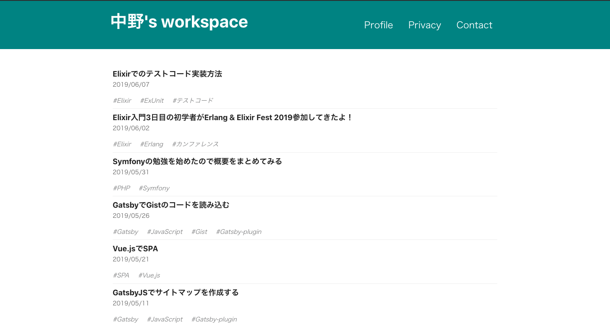
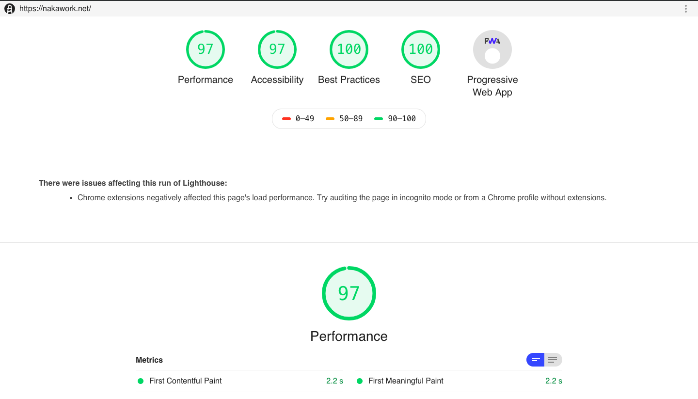

## 個人ブログを

## 1から

## 作ってみた
---

今回伝えたいこと
---

##  作るって楽しいよ！

---

自己紹介

まぶり

twitter(https://twitter.com/mabumaburi)

- エンジニア4年生
- サーバサイドエンジニア
- 普段はPHPとかJavaとかnode.jsとかガリガリ書いてます
-  フロント全然出来ません😇 

---

## 今回作ったもの

---
## パフォーマンス

---

